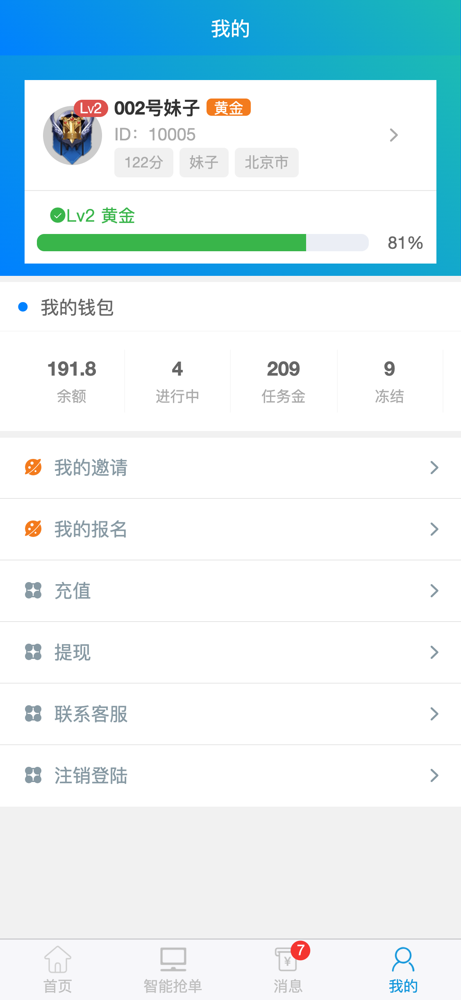

# 任务接单网站

> 基于vue+uni-app+caddy

# 架构描述

## 前端技术架构
- vue
- uni-app

## 后端技术架构
- nodejs
- mongodb
- pm2
- caddy

# 预览

## 前端




## Project setup
```
npm install
```

### Compiles and hot-reloads for development
```
npm run serve
```

### Compiles and minifies for production
```
npm run build
```

### Customize configuration
See [Configuration Reference](https://cli.vuejs.org/config/).
